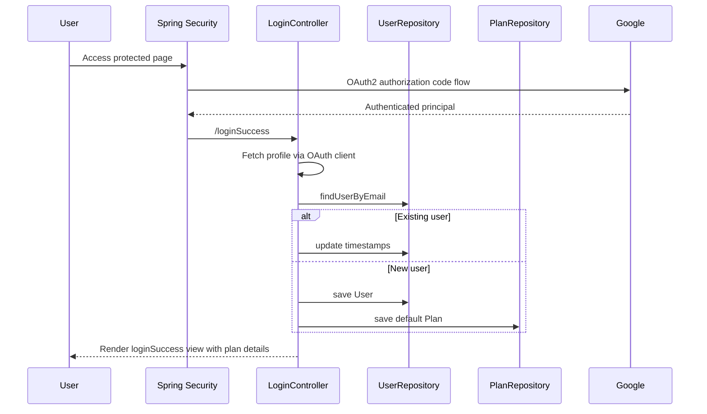
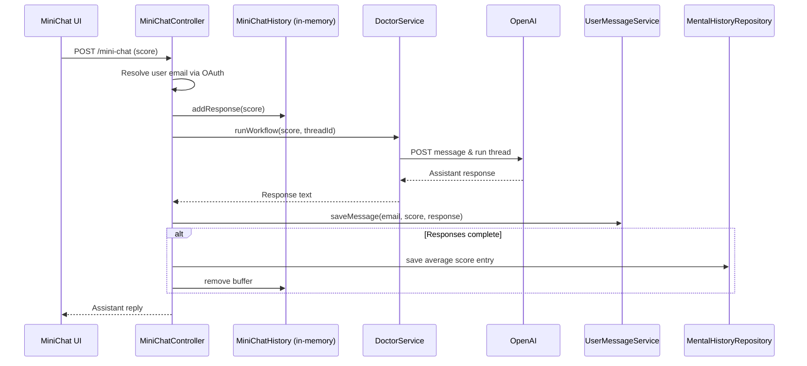

# Doctor API – Comprehensive Analysis

## 1. High-Level Overview
- **Technology stack**: Spring Boot application with MVC, Security OAuth2 client, Thymeleaf views, and JPA repositories backed by a MySQL database.【F:src/main/java/com/bunch/of/ideas/doctorapi/DoctorApiApplication.java†L1-L13】【F:src/main/resources/application.yml†L1-L38】
- **Primary capabilities**:
  - OAuth-based onboarding that persists user and subscription state while provisioning default plans.【F:src/main/java/com/bunch/of/ideas/doctorapi/controller/LoginController.java†L49-L124】【F:src/main/java/com/bunch/of/ideas/doctorapi/entity/Plan.java†L9-L108】
  - Conversational interfaces (full chat and "mini chat") that orchestrate OpenAI Threads API workflows and capture interaction history for mental health tracking.【F:src/main/java/com/bunch/of/ideas/doctorapi/controller/ChatController.java†L26-L45】【F:src/main/java/com/bunch/of/ideas/doctorapi/controller/MiniChatController.java†L49-L122】【F:src/main/java/com/bunch/of/ideas/doctorapi/service/DoctorService.java†L30-L143】
  - Historical insights and rate limiting that rely on persisted conversation metrics.【F:src/main/java/com/bunch/of/ideas/doctorapi/controller/MentalHistoryController.java†L22-L35】【F:src/main/java/com/bunch/of/ideas/doctorapi/service/UserMessageService.java†L17-L29】【F:src/main/java/com/bunch/of/ideas/doctorapi/repository/MentalHistoryRepository.java†L15-L19】
- **External integrations**: Google OAuth2 for authentication, OpenAI Threads API for assistant responses, and a managed MySQL instance for persistence.【F:src/main/resources/application.yml†L12-L35】【F:src/main/java/com/bunch/of/ideas/doctorapi/service/DoctorService.java†L30-L143】【F:src/main/java/com/bunch/of/ideas/doctorapi/service/LLMRequester.java†L20-L68】

## 2. Architecture Topology
### 2.1 Runtime Component Map
```mermaid
graph TD
    subgraph Client
        Views[Thymeleaf Views<br/>(chat, miniChat, history)]
    end
    subgraph Server
        Controllers[REST & MVC Controllers]
        Services[Domain Services]
        Repos[JPA Repositories]
        Security[Spring Security OAuth2]
    end
    subgraph Data
        DB[(MySQL Schema)]
    end
    subgraph External
        Google[Google OAuth2]
        OpenAI[OpenAI Threads API]
    end
    Views -->|Form submit/JS fetch| Controllers
    Controllers -->|Delegation| Services
    Services -->|Persistence| Repos
    Repos --> DB
    Security -. protects .-> Controllers
    Services -->|OAuth2 client| Google
    Services -->|HTTPS calls| OpenAI
```

### 2.2 Request Lifecycle Highlights
- OAuth login flows through Spring Security, landing in `LoginController` for user provisioning and plan setup.【F:src/main/java/com/bunch/of/ideas/doctorapi/config/SecurityConfig.java†L15-L45】【F:src/main/java/com/bunch/of/ideas/doctorapi/controller/LoginController.java†L49-L124】
- Chat views served by `TextController` initialize session context, while AJAX posts hit dedicated REST controllers that orchestrate the OpenAI workflow and persistence side effects.【F:src/main/java/com/bunch/of/ideas/doctorapi/controller/TextController.java†L30-L80】【F:src/main/resources/templates/chat.html†L70-L214】【F:src/main/java/com/bunch/of/ideas/doctorapi/controller/ChatController.java†L26-L45】【F:src/main/java/com/bunch/of/ideas/doctorapi/controller/MiniChatController.java†L49-L122】
- Data access via repositories encapsulates mental health scoring, message quotas, and plan lookups against MySQL tables defined by JPA entities.【F:src/main/java/com/bunch/of/ideas/doctorapi/repository/MentalHistoryRepository.java†L15-L19】【F:src/main/java/com/bunch/of/ideas/doctorapi/repository/UserMessageRepository.java†L1-L12】【F:src/main/java/com/bunch/of/ideas/doctorapi/entity/UserMessage.java†L7-L60】

## 3. Module Deep Dives
### 3.1 Bootstrapping & Configuration
- `DoctorApiApplication` boots Spring Boot with component scanning to wire MVC, security, and persistence layers.【F:src/main/java/com/bunch/of/ideas/doctorapi/DoctorApiApplication.java†L1-L13】
- `DoctorConfig` exposes OpenAI credentials, headers, and assistant identifiers via relaxed binding; values are loaded from `application.yml`.
  - Sensitive secrets (OpenAI API key, Google OAuth client credentials, database password) are currently committed in plaintext, creating high operational risk.【F:src/main/java/com/bunch/of/ideas/doctorapi/config/DoctorConfig.java†L6-L62】【F:src/main/resources/application.yml†L12-L35】
- `LLMRequester` centralizes OkHttp usage with a shared cached thread pool, but callers synchronously block on the returned `Future`, negating the benefits of asynchronous execution.【F:src/main/java/com/bunch/of/ideas/doctorapi/service/LLMRequester.java†L14-L68】【F:src/main/java/com/bunch/of/ideas/doctorapi/service/DoctorService.java†L30-L143】

### 3.2 Security and Authentication
- `SecurityConfig` enforces authentication for most routes, configures Google OAuth2 login, and customizes CSRF token handling to integrate with front-end AJAX requests.【F:src/main/java/com/bunch/of/ideas/doctorapi/config/SecurityConfig.java†L15-L45】
- `LoginController` drives the post-login experience: it fetches user profile data from the OAuth provider, upserts `User` records, and seeds a default `Plan` with free-tier quotas.【F:src/main/java/com/bunch/of/ideas/doctorapi/controller/LoginController.java†L49-L124】【F:src/main/java/com/bunch/of/ideas/doctorapi/entity/User.java†L9-L81】【F:src/main/java/com/bunch/of/ideas/doctorapi/entity/Plan.java†L9-L108】
- Several subscription management endpoints are scaffolded but commented out, indicating planned expansion for billing features.【F:src/main/java/com/bunch/of/ideas/doctorapi/controller/LoginController.java†L126-L191】

### 3.3 Conversational Experience Services
- `ChatController` targets a hard-coded demo user, creating threads on demand and delegating to `DoctorService` for OpenAI interactions—highlighting a need for multi-user generalization.【F:src/main/java/com/bunch/of/ideas/doctorapi/controller/ChatController.java†L26-L45】
- `DoctorService` encapsulates the OpenAI Threads lifecycle: creating threads, posting messages, triggering runs, polling for completion, and extracting assistant responses from nested message content.【F:src/main/java/com/bunch/of/ideas/doctorapi/service/DoctorService.java†L30-L143】
- Front-end chat UI renders via Thymeleaf and Bootstrap, using AJAX calls to `/sendMessage` and local typing indicators to maintain responsiveness.【F:src/main/resources/templates/chat.html†L70-L214】

### 3.4 Mini Chat & Mental Health Tracking
- `MiniChatController` maintains per-user response buffers in an in-memory `ConcurrentHashMap`, calculates average scores once five responses are collected, and persists them to `MentalHistory` alongside OpenAI workflow execution.【F:src/main/java/com/bunch/of/ideas/doctorapi/controller/MiniChatController.java†L39-L95】【F:src/main/java/com/bunch/of/ideas/doctorapi/entity/MiniChatHistory.java†L6-L43】【F:src/main/java/com/bunch/of/ideas/doctorapi/entity/MentalHistory.java†L8-L52】
- `MentalHistoryController` exposes weekly and monthly aggregates, leveraging a custom JPA query that filters by email and date range.【F:src/main/java/com/bunch/of/ideas/doctorapi/controller/MentalHistoryController.java†L22-L35】【F:src/main/java/com/bunch/of/ideas/doctorapi/repository/MentalHistoryRepository.java†L15-L19】
- `MessageController` and `UserMessageService` implement quota enforcement by checking mental history counts and counting persisted user messages, though the quota limit (five messages) is hard-coded.【F:src/main/java/com/bunch/of/ideas/doctorapi/controller/MessageController.java†L18-L26】【F:src/main/java/com/bunch/of/ideas/doctorapi/service/UserMessageService.java†L17-L29】

### 3.5 Persistence Layer
- Entities map directly to database tables with minimal annotations; `Plan`, `User`, `MentalHistory`, and `UserMessage` capture subscription, identity, scoring, and interaction data respectively.【F:src/main/java/com/bunch/of/ideas/doctorapi/entity/Plan.java†L9-L108】【F:src/main/java/com/bunch/of/ideas/doctorapi/entity/User.java†L9-L81】【F:src/main/java/com/bunch/of/ideas/doctorapi/entity/MentalHistory.java†L8-L52】【F:src/main/java/com/bunch/of/ideas/doctorapi/entity/UserMessage.java†L7-L60】
- Repository interfaces extend `CrudRepository`/`JpaRepository` to offer custom queries for plan lookups and temporal filtering without additional service abstractions.【F:src/main/java/com/bunch/of/ideas/doctorapi/repository/PlanRepository.java†L12-L15】【F:src/main/java/com/bunch/of/ideas/doctorapi/repository/MentalHistoryRepository.java†L15-L19】

### 3.6 Presentation Layer
- `TextController` supplies Thymeleaf templates with user metadata and empty message lists, relying on OAuth2 authentication tokens to retrieve profile data per request.【F:src/main/java/com/bunch/of/ideas/doctorapi/controller/TextController.java†L30-L80】
- `chat.html` defines the primary conversational UI, including client-side rate-limit toggling and CSRF-aware AJAX requests; similar templates exist for mini chat and history views (not shown here).【F:src/main/resources/templates/chat.html†L70-L214】

## 4. Business Workflow Mapping
### 4.1 OAuth Sign-In & Plan Provisioning

- Ensures each OAuth login refreshes user metadata and enforces plan defaults for new customers.【F:src/main/java/com/bunch/of/ideas/doctorapi/controller/LoginController.java†L68-L124】

### 4.2 Mini Chat Scoring & OpenAI Interaction

- Demonstrates how the mini session balances synchronous chat responses with asynchronous mental health scoring and persistence side effects.【F:src/main/java/com/bunch/of/ideas/doctorapi/controller/MiniChatController.java†L49-L95】【F:src/main/java/com/bunch/of/ideas/doctorapi/service/DoctorService.java†L30-L143】

## 5. Design Patterns & Code Quality Observations
- **Layered pattern**: Controllers delegate to services which in turn call repositories and external APIs, following conventional Spring layering.【F:src/main/java/com/bunch/of/ideas/doctorapi/controller/ChatController.java†L26-L45】【F:src/main/java/com/bunch/of/ideas/doctorapi/service/DoctorService.java†L30-L143】【F:src/main/java/com/bunch/of/ideas/doctorapi/repository/MentalHistoryRepository.java†L15-L19】
- **Template & repository usage**: Thymeleaf templates handle presentation while repositories expose thin data access layers without domain services, leading to some business rules (e.g., quotas) living directly in controllers/services.【F:src/main/resources/templates/chat.html†L70-L214】【F:src/main/java/com/bunch/of/ideas/doctorapi/service/UserMessageService.java†L17-L29】
- **Async anti-pattern**: Although `LLMRequester` uses `ExecutorService`, the immediate `Future#get()` calls revert to blocking behavior and risk thread exhaustion under load.【F:src/main/java/com/bunch/of/ideas/doctorapi/service/LLMRequester.java†L14-L68】【F:src/main/java/com/bunch/of/ideas/doctorapi/service/DoctorService.java†L30-L143】
- **State management**: Mini chat relies on controller-level mutable state (`ConcurrentHashMap`), which is fragile in multi-instance deployments and complicates testing.【F:src/main/java/com/bunch/of/ideas/doctorapi/controller/MiniChatController.java†L39-L95】

## 6. Technical Debt & Risk Assessment
1. **Credential exposure** – Production secrets (OpenAI key, Google client secret, database password) are stored in source control, violating security best practices and likely breaching provider terms.【F:src/main/resources/application.yml†L16-L35】
2. **Blocking polling loop** – `DoctorService.runWorkflow` polls every second without timeout or backoff, risking long-lived threads and poor user experience when OpenAI delays responses.【F:src/main/java/com/bunch/of/ideas/doctorapi/service/DoctorService.java†L109-L143】
3. **Hard-coded identities** – `ChatController` assumes a single demo email, preventing real multi-user operation and risking data leaks if reused beyond testing.【F:src/main/java/com/bunch/of/ideas/doctorapi/controller/ChatController.java†L26-L45】
4. **In-memory session state** – Mini chat response tracking is not persisted; server restarts or horizontal scaling will corrupt user workflows.【F:src/main/java/com/bunch/of/ideas/doctorapi/controller/MiniChatController.java†L39-L95】
5. **Insufficient validation** – Incoming scores are parsed without range checks, while message limits rely on database counts that could be bypassed with direct API calls.【F:src/main/java/com/bunch/of/ideas/doctorapi/controller/MiniChatController.java†L54-L79】【F:src/main/java/com/bunch/of/ideas/doctorapi/service/UserMessageService.java†L17-L29】
6. **Lack of error handling** – Repositories and services throw runtime exceptions without graceful degradation or user feedback pathways, leaving the UI to fail silently.【F:src/main/java/com/bunch/of/ideas/doctorapi/service/DoctorService.java†L30-L143】【F:src/main/resources/templates/chat.html†L180-L189】
7. **Testing gap** – Only a context-loading test exists; there are no unit or integration tests for business-critical flows, increasing regression risk.【F:src/test/java/com/bunch/of/ideas/doctorapi/DoctorApiApplicationTests.java†L1-L14】

## 7. Recommendations & Future Opportunities
1. **Secrets management**: Move OAuth, database, and OpenAI credentials to environment variables or a secret vault; enforce configuration profiles for local vs. production environments.【F:src/main/resources/application.yml†L16-L35】
2. **Resilient OpenAI orchestration**: Introduce timeouts, exponential backoff, and asynchronous callbacks or webhooks to avoid tight polling loops; consider streaming responses for better UX.【F:src/main/java/com/bunch/of/ideas/doctorapi/service/DoctorService.java†L109-L143】
3. **Multi-tenant chat architecture**: Replace hard-coded email logic with authenticated principals, store thread identifiers per user, and share logic between standard and mini chat flows via dedicated services.【F:src/main/java/com/bunch/of/ideas/doctorapi/controller/ChatController.java†L26-L45】【F:src/main/java/com/bunch/of/ideas/doctorapi/controller/MiniChatController.java†L49-L95】
4. **State persistence for mini sessions**: Persist interim questionnaire responses (e.g., in Redis or relational tables) instead of in-memory maps to ensure durability and scalability.【F:src/main/java/com/bunch/of/ideas/doctorapi/controller/MiniChatController.java†L39-L95】
5. **Validation & rate limiting**: Enforce server-side validation on score ranges and message payloads; expose consistent quota policies using configuration-driven limits rather than hard-coded integers.【F:src/main/java/com/bunch/of/ideas/doctorapi/controller/MiniChatController.java†L54-L79】【F:src/main/java/com/bunch/of/ideas/doctorapi/service/UserMessageService.java†L17-L29】
6. **Observability & error UX**: Wrap external calls with circuit breakers, add structured logging, and surface actionable error messages to the front end to avoid silent failures.【F:src/main/java/com/bunch/of/ideas/doctorapi/service/DoctorService.java†L30-L143】【F:src/main/resources/templates/chat.html†L180-L189】
7. **Testing strategy**: Build unit tests for OpenAI orchestration logic using stubs, integration tests for OAuth-driven user provisioning, and contract tests for repository queries to support future refactors.【F:src/main/java/com/bunch/of/ideas/doctorapi/service/DoctorService.java†L30-L143】【F:src/main/java/com/bunch/of/ideas/doctorapi/controller/LoginController.java†L49-L124】【F:src/main/java/com/bunch/of/ideas/doctorapi/repository/MentalHistoryRepository.java†L15-L19】
8. **Product roadmap alignment**: Activate the commented subscription management endpoints once billing integration is ready, and align plan limits with business tiers exposed in the UI for transparency.【F:src/main/java/com/bunch/of/ideas/doctorapi/controller/LoginController.java†L126-L191】【F:src/main/java/com/bunch/of/ideas/doctorapi/entity/Plan.java†L9-L108】

---
Prepared by: *Repository Analysis Agent*  
Date: $(date +"%Y-%m-%d")
